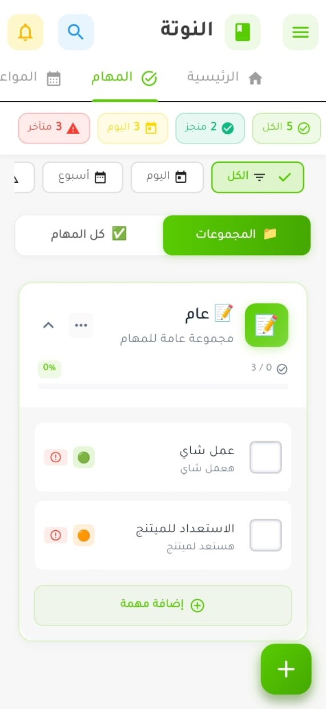

<div align="center">

# 📝 Nota

### AI-Powered Smart Notes & Diary Application

[](https://flutter.dev)
[](https://firebase.google.com)
[](https://ai.google.dev)
[](https://dart.dev)
[](LICENSE)
[](CONTRIBUTING.md)

<br/>

[🌟 Features](#-features) • [📦 Installation](#-installation) • [📸 Screenshots](#-screenshots) • [🛠️ Tech Stack](#️-tech-stack) • [🤝 Contributing](#-contributing) • [📄 Docs](#-documentation)

---


### **Transform your thoughts into organized actions with AI** ✨

<br/>

[](/)
[](/)
[](/)
[](/)
[](/)
[](/)

</div>

---

## 🌟 Overview

**Nota** is a revolutionary AI-powered notes and diary application that transforms how you capture and organize your thoughts. Simply input via **text, voice, or camera**, and watch as our intelligent AI engine automatically categorizes your content into meaningful sections.

> 🇸🇦 **Full Arabic RTL Support** - Designed with Arabic users in mind, featuring beautiful Tajawal fonts and right-to-left layouts.

### 🎯 What Makes Nota Special?

<table>
<tr>
<td width="50%">

#### 🤖 AI-Powered Intelligence
Automatically categorizes notes using **Gemini 2.5 Flash** - Google's latest AI model. Just type naturally and let AI do the organizing.

#### 🎤 Multi-Input Support  
Input via **text, voice recording, or camera capture**. Perfect for capturing thoughts on the go.

#### 📊 Smart Organization
Automatically sorts into **Tasks, Appointments, Expenses**, and **Personal Notes** with smart extraction of dates, amounts, and priorities.

</td>
<td width="50%">

#### 🔐 Secure Authentication
6 login methods: **Email, Google, Facebook, GitHub, Apple**, and **Biometric** (Fingerprint/Face ID).

#### 🌙 Beautiful Modern UI
Sleek design with **smooth animations**, **haptic feedback**, and **Material 3** design language.

#### ☁️ Real-time Cloud Sync
All data synced with **Firebase** in real-time. Access from any device, anytime.

</td>
</tr>
</table>

---

## ✨ Features

### 📱 Core Features

<table>
<tr>
<td align="center" width="33%">

<br/><strong>📝 Smart Notes</strong>
<br/><sub>Create notes that are automatically categorized by AI</sub>
</td>
<td align="center" width="33%">

<br/><strong>✅ Tasks & To-Dos</strong>
<br/><sub>Manage tasks with priorities, due dates, and subtasks</sub>
</td>
<td align="center" width="33%">

<br/><strong>📅 Appointments</strong>
<br/><sub>Schedule and track with calendar integration</sub>
</td>
</tr>
<tr>
<td align="center">

<br/><strong>💰 Expense Tracking</strong>
<br/><sub>Log expenses with categories and amounts</sub>
</td>
<td align="center">

<br/><strong>🔍 Smart Search</strong>
<br/><sub>Find anything instantly with intelligent search</sub>
</td>
<td align="center">

<br/><strong>📊 Dashboard</strong>
<br/><sub>Beautiful overview of all your content</sub>
</td>
</tr>
</table>

### 🔐 Authentication Methods

<div align="center">

| Method | Status | Description |
|:------:|:------:|-------------|
| ✉️ **Email/Password** | ✅ | Traditional email authentication with verification |
| 🔵 **Google** | ✅ | One-tap Google Sign-In |
| 📘 **Facebook** | ✅ | Facebook OAuth integration |
| 🐙 **GitHub** | ✅ | GitHub OAuth for developers |
| 🍎 **Apple** | ✅ | Sign in with Apple (iOS/macOS) |
| 👆 **Biometric** | ✅ | Fingerprint & Face ID support |

</div>

### 🎤 Smart Input Methods

```
┌─────────────────────────────────────────────────────────────────┐
│                                                                 │
│   ⌨️ TEXT          🎙️ VOICE         📷 CAMERA        🖼️ GALLERY  │
│   ──────          ─────          ──────        ───────  │
│   Type your       Speak and      Capture       Import   │
│   thoughts        transcribe     receipts      images   │
│   naturally       instantly      & docs        for AI   │
│                                                                 │
└─────────────────────────────────────────────────────────────────┘
```

### 🤖 AI Capabilities (Gemini 2.5 Flash)

| Capability | Description |
|:----------:|-------------|
| 🏷️ **Auto-Categorization** | Notes → Tasks, Appointments, Expenses, or Personal |
| 📅 **Date Extraction** | Automatically detects dates like "غداً" or "next Monday" |
| 💵 **Amount Detection** | Extracts currency and amounts from text |
| ⚡ **Priority Analysis** | Detects urgency from context |
| 🌍 **Bilingual Support** | Understands Arabic & English naturally |
| 🧠 **Context Awareness** | Learns from your usage patterns |

---

## 📸 Screenshots

<div align="center">

### 🔐 Authentication Flow

<table>
<tr>
<td align="center"><strong>Splash Screen</strong></td>
<td align="center"><strong>Login</strong></td>
<td align="center"><strong>Register</strong></td>
<td align="center"><strong>Forgot Password</strong></td>
</tr>
<tr>
<td></td>
<td></td>
<td></td>
<td></td>
</tr>
</table>

### 📱 Main App

<table>
<tr>
<td align="center"><strong>Dashboard</strong></td>
<td align="center"><strong>AI Input</strong></td>
<td align="center"><strong>Tasks</strong></td>
<td align="center"><strong>Appointments</strong></td>
<td align="center"><strong>Quotes</strong></td>
</tr>
<tr>
<td></td>
<td></td>
<td></td>
<td></td>
<td></td>
<td></td>
</tr>
</table>

</div>

---

## 🛠️ Tech Stack

<div align="center">

### Frontend & UI

| Technology | Version | Purpose |
|:----------:|:-------:|---------|
|  | 3.3+ | Cross-platform UI framework |
|  | 3.0+ | Programming language |
|  | Latest | Design system |
|  | - | Tajawal Arabic font |

### Backend & Cloud Services

| Technology | Purpose |
|:----------:|---------|
|  | Multi-provider authentication |
|  | Real-time NoSQL database |
|  | Image & file storage |
|  | Media management CDN |

### AI & Machine Learning

| Technology | Model | Purpose |
|:----------:|:-----:|---------|
|  | 2.5 Flash | AI categorization & extraction |
|  | - | Voice transcription |

### Key Packages

```yaml
dependencies:
  # Firebase Suite
  firebase_core: ^3.8.0
  firebase_auth: ^5.3.3
  cloud_firestore: ^5.5.0
  firebase_storage: ^12.4.10
  
  # Social Authentication
  google_sign_in: ^6.2.2
  flutter_facebook_auth: ^7.1.1
  local_auth: ^2.3.0  # Biometric
  
  # AI Integration
  google_generative_ai: ^0.4.7
  speech_to_text: ^7.3.0
  
  # UI & Animations
  flutter_animate: ^4.5.0
  lottie: ^3.1.3
  google_fonts: ^6.3.0
  
  # Media & Input
  camera: ^0.10.3
  image_picker: ^1.1.1
```

</div>

---

## 📦 Installation

<details>
<summary><strong>📋 Prerequisites</strong></summary>

- ✅ Flutter SDK 3.3.0 or higher
- ✅ Dart SDK 3.0.0 or higher
- ✅ Android Studio / VS Code with Flutter extensions
- ✅ Firebase account (free tier works)
- ✅ Gemini API key ([Get free key](https://ai.google.dev))
- ✅ Git installed

</details>

### 🚀 Quick Start

```bash
# 1️⃣ Clone the repository
git clone https://github.com/Lord-shaban/Nota.git
cd nota

# 2️⃣ Install dependencies
flutter pub get

# 3️⃣ Run the app
flutter run
```

### ⚙️ Full Setup Guide

<details>
<summary><strong>Step 1: Firebase Configuration</strong></summary>

1. Create a project at [Firebase Console](https://console.firebase.google.com)
2. Enable these services:
   - ✅ Authentication (Email, Google, Facebook, GitHub, Apple)
   - ✅ Cloud Firestore
   - ✅ Firebase Storage
3. Download configuration files:
   ```
   android/app/google-services.json     # Android
   ios/Runner/GoogleService-Info.plist  # iOS
   ```

</details>

<details>
<summary><strong>Step 2: Gemini AI Setup</strong></summary>

1. Get API key from [Google AI Studio](https://ai.google.dev)
2. Create `.env` file in root directory:
   ```env
   GEMINI_API_KEY=your_api_key_here
   ```

</details>

<details>
<summary><strong>Step 3: Social Auth Setup</strong></summary>

See [📄 SOCIAL_AUTH_SETUP.md](docs/SOCIAL_AUTH_SETUP.md) for detailed instructions:

| Provider | Setup Link |
|----------|------------|
| 🔵 Google | [Google Cloud Console](https://console.cloud.google.com) |
| 📘 Facebook | [Facebook Developers](https://developers.facebook.com) |
| 🐙 GitHub | [GitHub OAuth Apps](https://github.com/settings/developers) |
| 🍎 Apple | [Apple Developer](https://developer.apple.com) |

</details>

<details>
<summary><strong>Step 4: Run on Different Platforms</strong></summary>

```bash
# 📱 Android
flutter run -d android

# 🍎 iOS
flutter run -d ios

# 🌐 Web
flutter run -d chrome

# 🖥️ Desktop (Windows/macOS/Linux)
flutter run -d windows
flutter run -d macos
flutter run -d linux

# 🚀 Release Build
flutter build apk --release        # Android APK
flutter build appbundle --release  # Android App Bundle
flutter build ios --release        # iOS
flutter build web --release        # Web
```

</details>

---

## 📁 Project Structure

```
nota/
│
├── 📱 lib/                           # Main source code
│   ├── main.dart                     # App entry point
│   ├── firebase_options.dart         # Firebase configuration
│   │
│   ├── 🎨 core/                      # Core utilities
│   │   ├── models/                   # Data models (UserModel, NoteModel, etc.)
│   │   ├── theme/                    # App theme & colors
│   │   └── utils/                    # Helper functions
│   │
│   └── ⚡ features/                   # Feature modules
│       │
│       ├── 🔐 auth/                  # Authentication
│       │   ├── login/                # Enhanced login screen
│       │   ├── register/             # Registration with password strength
│       │   ├── splash/               # Animated splash screen
│       │   ├── services/             # AuthService, SocialAuthService
│       │   └── widgets/              # Reusable auth widgets
│       │
│       ├── 🏠 dashboard/             # Home dashboard
│       │   ├── home_screen.dart      # Main dashboard
│       │   └── widgets/              # Dashboard widgets
│       │
│       ├── 📝 notes/                 # Notes feature
│       │   ├── screens/              # Note list & detail screens
│       │   └── widgets/              # Note cards & forms
│       │
│       ├── ✅ tasks/                  # Tasks feature
│       │   ├── screens/              # Task management screens
│       │   └── widgets/              # Task widgets
│       │
│       └── 🤖 ai/                    # AI integration
│           ├── ai_input_screen.dart  # Smart AI input
│           └── services/             # Gemini AI service
│
├── 🤖 android/                       # Android platform
├── 🍎 ios/                           # iOS platform
├── 🌐 web/                           # Web platform
├── 🖥️ windows/                       # Windows desktop
├── 🖥️ macos/                         # macOS desktop
├── 🐧 linux/                         # Linux desktop
│
├── 🧪 test/                          # Tests
│   ├── unit/                         # Unit tests
│   ├── widget/                       # Widget tests
│   └── integration/                  # Integration tests
│
├── 📚 docs/                          # Documentation
│   ├── AUTH_SYSTEM_README.md
│   ├── SOCIAL_AUTH_SETUP.md
│   └── TASKS_FEATURE.md
│
└── 📄 Configuration Files
    ├── pubspec.yaml                  # Dependencies
    ├── analysis_options.yaml         # Lint rules
    └── firebase.json                 # Firebase config
```

---

## 🧪 Testing

<div align="center">

| Test Type | Command | Description |
|:---------:|---------|-------------|
| 🔬 Unit | `flutter test test/unit/` | Test business logic |
| 🧩 Widget | `flutter test test/widget/` | Test UI components |
| 🔗 Integration | `flutter test integration_test/` | Test full flows |
| 📊 Coverage | `flutter test --coverage` | Generate coverage report |

</div>

```bash
# Run all tests
flutter test

# Run with verbose output
flutter test --reporter expanded

# Run specific test file
flutter test test/unit/auth_service_test.dart

# Generate coverage report
flutter test --coverage
genhtml coverage/lcov.info -o coverage/html
open coverage/html/index.html
```

---

## 🤝 Contributing

We love contributions! Here's how to get started:

<div align="center">

```
┌────────────────────────────────────────────────────────────┐
│                     CONTRIBUTION FLOW                       │
├────────────────────────────────────────────────────────────┤
│                                                            │
│   1️⃣ Fork  →  2️⃣ Clone  →  3️⃣ Branch  →  4️⃣ Code  →  5️⃣ PR   │
│                                                            │
└────────────────────────────────────────────────────────────┘
```

</div>

### 📝 Step by Step

1. 📖 Read [CONTRIBUTING.md](CONTRIBUTING.md)
2. 🍴 Fork the repository
3. 🌿 Create feature branch:
   ```bash
   git checkout -b feature/amazing-feature
   ```
4. 💾 Make changes and commit:
   ```bash
   git commit -m 'feat: add amazing feature'
   ```
5. 📤 Push to your fork:
   ```bash
   git push origin feature/amazing-feature
   ```
6. 🔃 Open a Pull Request

### 📋 Commit Convention

We follow [Conventional Commits](https://www.conventionalcommits.org/):

| Emoji | Type | Description |
|:-----:|:----:|-------------|
| ✨ | `feat:` | New feature |
| 🐛 | `fix:` | Bug fix |
| 📚 | `docs:` | Documentation |
| 💄 | `style:` | UI/styling changes |
| ♻️ | `refactor:` | Code refactoring |
| 🧪 | `test:` | Adding tests |
| 🔧 | `chore:` | Maintenance |
| ⚡ | `perf:` | Performance improvement |

---

## 👥 Team

<div align="center">

<table>
<tr>

<td align="center">

<br/><strong>GoldenBoy13420</strong>
<br/><sub>🎯 Project Lead</sub>
<br/>
<a href="https://github.com/GoldenBoy13420">

</a>
</td>

<td align="center">

<br/><strong>Lord-shaban</strong>
<br/><sub>💻 Developer</sub>
<br/>
<a href="https://github.com/Lord-shaban">

</a>
</td>
<td align="center">

<br/><strong>Ali-0110</strong>
<br/><sub>💻 Developer</sub>
<br/>
<a href="https://github.com/Ali-0110">

</a>
</td>
<td align="center">

<br/><strong>abdelrahman hesham</strong>
<br/><sub>💻 Developer</sub>
<br/>
<a href="https://github.com/abdelrahman-hesham11">

</a>
</tr>
</table>

</div>

---

## 📄 Documentation

<div align="center">

| 📚 Document | 📝 Description |
|:-----------:|---------------|
| [🔐 AUTH_SYSTEM_README](docs/AUTH_SYSTEM_README.md) | Complete authentication system documentation |
| [🌐 SOCIAL_AUTH_SETUP](docs/SOCIAL_AUTH_SETUP.md) | Setup guide for Google, Facebook, GitHub, Apple |
| [✅ TASKS_FEATURE](docs/TASKS_FEATURE.md) | Tasks & to-dos feature documentation |
| [📅 ENHANCED_TASKS_SUMMARY](docs/ENHANCED_TASKS_SUMMARY.md) | Enhanced tasks with subtasks & priorities |
| [🤖 AI_TESTING](AI_TESTING.md) | AI testing guidelines & examples |
| [🤝 CONTRIBUTING](CONTRIBUTING.md) | Contribution guidelines |
| [🔒 SECURITY](SECURITY.md) | Security policies & vulnerability reporting |
| [📜 CODE_OF_CONDUCT](CODE_OF_CONDUCT.md) | Community code of conduct |

</div>

---

## 🔒 Security

Your security is our priority. Please read [SECURITY.md](SECURITY.md) for:

- 🚨 Reporting vulnerabilities
- 🔐 Security best practices
- 🛡️ Data protection policies
- 🔑 Authentication security measures

---

## 🗺️ Roadmap

<div align="center">

| Phase | Feature | Status |
|:-----:|---------|:------:|
| ✅ | Core authentication system | Done |
| ✅ | Social login (Google, Facebook, GitHub, Apple) | Done |
| ✅ | Biometric authentication | Done |
| ✅ | AI-powered note categorization | Done |
| ✅ | Voice input & transcription | Done |
| ✅ | Camera & image input | Done |
| ✅ | Enhanced UI with animations | Done |
| 🔄 | Offline mode with sync | In Progress |
| 📋 | Widgets for home screen | Planned |
| 📋 | Apple Watch / Wear OS support | Planned |
| 📋 | Desktop native features | Planned |
| 📋 | AI-powered suggestions | Planned |

</div>

---

## 📋 Project Board

Track our progress and upcoming features:

<div align="center">

[](https://github.com/Lord-shaban/Nota/projects)

</div>

---

## 📜 License

<div align="center">

This project is licensed under the **MIT License**

[](LICENSE)

```
MIT License

Copyright (c) 2024-2026 Nota Team

Permission is hereby granted, free of charge, to any person obtaining a copy
of this software and associated documentation files (the "Software"), to deal
in the Software without restriction, including without limitation the rights
to use, copy, modify, merge, publish, distribute, sublicense, and/or sell
copies of the Software, and to permit persons to whom the Software is
furnished to do so, subject to the following conditions:

The above copyright notice and this permission notice shall be included in all
copies or substantial portions of the Software.
```

</div>

---

<div align="center">

## ⭐ Support

**If you find Nota helpful, please give it a star!**

It helps us grow and motivates the team to keep improving.

<br/>

[](https://github.com/Lord-shaban/Nota/stargazers)
[](https://github.com/Lord-shaban/Nota/network/members)
[](https://github.com/Lord-shaban/Nota/watchers)

---


### Made with ❤️ by the Nota Team

**Transform your thoughts. Organize your life.**

<br/>

[](https://flutter.dev)
[](https://firebase.google.com)
[](https://ai.google.dev)

</div>


